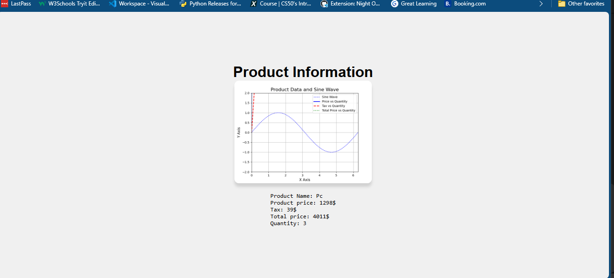

# Make Chert of you'r Product and Show in web

~~~~
import os
from math import ceil
import matplotlib.pyplot as plt
import numpy as np
import webbrowser

# Initialize the plot
fig, ax = plt.subplots()

class Products:
    def __init__(self, price, quantity, name) -> None:
        self.price = price
        self.quantity = quantity
        self.name = name 
        # Tax is 3%
        self.tax = ceil(price * 0.03)
        self.totalPrice = (price + self.tax) * quantity

    def _getChart(self):
        # Create a sine wave for the base chart
        x = np.linspace(0, 2 * np.pi, 100)
        ax.plot(x, np.sin(x), label="Sine Wave", color="blue", linestyle="--", linewidth=1)
  
        # Set axis limits, labels, and title
        ax.set_ylim(-2, 2)
        ax.set_xlim(0, 2 * np.pi)
        ax.set_title('Product Data and Sine Wave', fontsize=16)
        ax.set_xlabel('X Axis', fontsize=12)
        ax.set_ylabel('Y Axis', fontsize=12)
        ax.grid(True)

        # Plot lines for price, quantity, tax, and total price
        ax.plot([0, self.quantity], [0, self.price], 'b-', label='Price vs Quantity', linewidth=2)
        ax.plot([0, self.quantity], [0, self.tax], 'r--', label='Tax vs Quantity', linewidth=2)
        ax.plot([0, self.quantity], [0, self.totalPrice], 'g:', label='Total Price vs Quantity', linewidth=2)

        # Annotations to show important points
        ax.annotate(f'Price: {self.price}', xy=(self.quantity, self.price), xytext=(self.quantity - 1, self.price + 0.5),
                    arrowprops=dict(facecolor='black', shrink=0.05), fontsize=10)
        ax.annotate(f'Total: {self.totalPrice}', xy=(self.quantity, self.totalPrice), xytext=(self.quantity - 1, self.totalPrice + 0.5),
                    arrowprops=dict(facecolor='green', shrink=0.05), fontsize=10)
  
        # Adding the legend
        ax.legend()

        # Create directories if they don't exist
        os.makedirs("media", exist_ok=True)
        os.makedirs("text", exist_ok=True)

        # Save the chart as an image and open in browser
        plt.savefig(f"media/{self.name}.png")
        #by defute this is vscode URL change for you'r URL
        webbrowser.open("http://127.0.0.1:5500/day_2/index.html")

        # Write product details to a text file
        with open(f"text/{self.name}.txt", "w") as file:
            file.write(f"Product Name: {self.name}\n")
            file.write(f"Product price: {self.price}$\n")
            file.write(f"Tax: {self.tax}$\n")
            file.write(f"Total price: {self.totalPrice}$\n")
            file.write(f"Quantity: {self.quantity}\n")

    def __str__(self):
        return f"Product price: {self.price}, Tax: {self.tax}, Total price: {self.totalPrice}, Quantity: {self.quantity}"

# Input for price and quantity
name = input("Name of Product: ")
tShirtPrice = int(input("Price of product: "))
tShirtQuantity = int(input("Quantity: "))
tShirt = Products(price=tShirtPrice, quantity=tShirtQuantity, name=name)

tShirt._getChart()

~~~~

